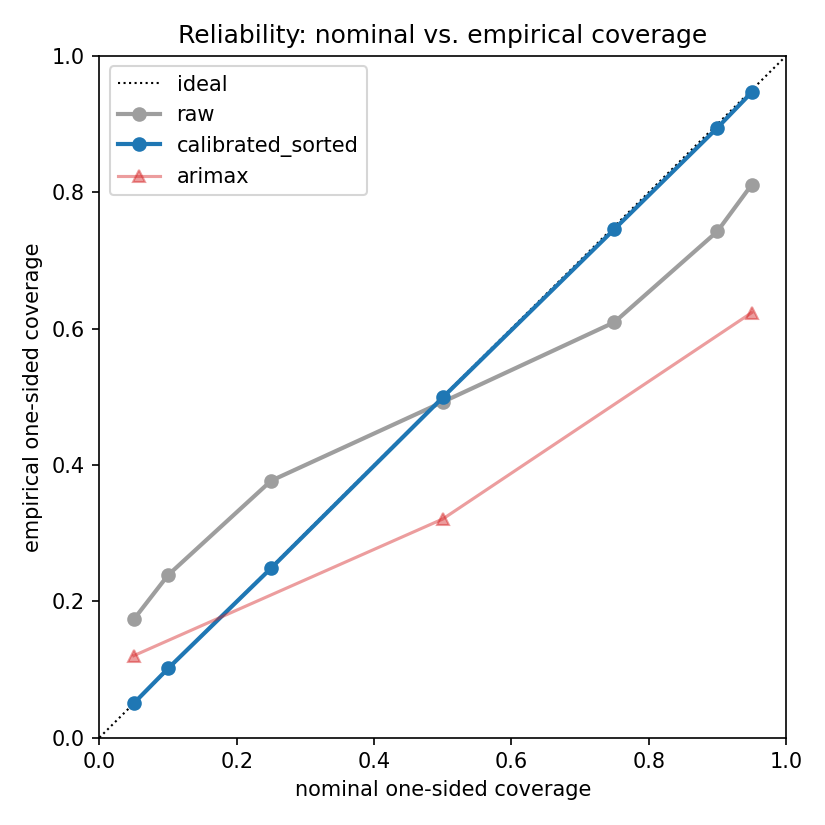
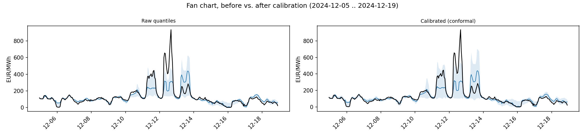
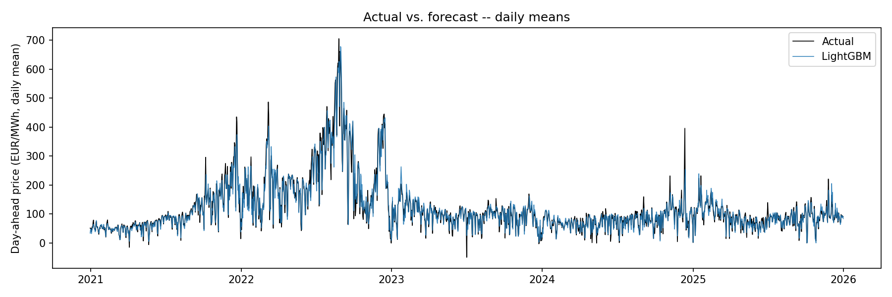
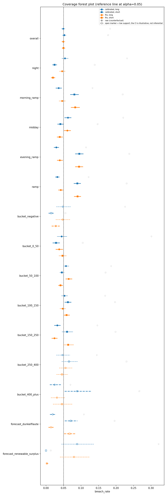

# Model Validation Report — Day-Ahead Power Price Forecasting & Risk Backtesting (DE-LU)

**Date:** 2026-07-15
**Version:** v1.0

This document is an independent-validation-style review of a single-author portfolio project. It is written in the form and with the scrutiny of a second line of defence in a model risk function, applied here to a personal project rather than to an organisationally independent review process -- that distinction is stated explicitly rather than implied. All figures in this report are traced to persisted, reproducible outputs; none are estimated or recalled from memory.

---

## 1. Executive Summary

The reviewed system forecasts hourly German-Luxembourg (DE-LU) day-ahead electricity prices -- point and quantile -- and derives a trading-book Value-at-Risk (VaR) and Expected Shortfall (ES) for a hypothetical 10 MWh book from the calibrated quantile forecasts. Validation covers both layers: point/quantile forecast accuracy under a leakage-free walk-forward design, and a full statistical backtest of the resulting risk measure (Kupiec, Christoffersen, Acerbi-Szekely, and a month-stratified day-block bootstrap).

The point forecast (LightGBM) outperforms all evaluated benchmarks (Naive, Lasso, ARIMAX) by a wide margin. The raw quantile forecasts are severely under-covered; scaled conformal recalibration corrects this at the unconditional level, and the resulting calibrated risk measure passes its unconditional backtest (Kupiec does not reject at the `overall` subset for either book side). Conditionally, it does not fully hold: 35 of 60 validated (variant, side, subset) cells reject an honest, day-block-bootstrapped coverage test, concentrated in the evening ramp and the upper forecast-height buckets, and driven by one underlying mechanism -- intraday and day-level heteroskedasticity that the current calibration scale does not capture.

**Overall verdict: fit for the stated purpose (probabilistic day-ahead forecasting and risk-measure backtesting under a leakage-free evaluation) within the documented limitations.** The unconditional risk measure is validated and traceable; its conditional weaknesses are known, quantified, and not remediated by the current calibration scale. See the Findings & Limitations catalogue (Section 7) for the complete, classified list.

---

## 2. Model Purpose & Scope

**What is forecast.** Hourly day-ahead electricity prices (EUR/MWh) for the DE-LU bidding zone: a point forecast (median, alpha=0.5) and a seven-level quantile grid (0.05/0.10/0.25/0.50/0.75/0.90/0.95), produced one delivery day at a time (24, or 23/25 on a DST day, hours at once).

**What it is used for.** (a) A stand-alone probabilistic price forecast, compared against a seasonal-naive benchmark and two simpler statistical/linear alternatives (Lasso, ARIMAX). (b) A conformal-calibrated quantile grid feeding a hypothetical trading book (flat 10 MWh, long and short), from which VaR and ES are derived and independently backtested -- the project's central methodological contribution.

**Explicit application boundaries:**
- **Not a live or production system.** There is no live data ingestion, scheduling, or real-time inference; the pipeline runs on historical, retrospectively-evaluated data only.
- **Not a trading-strategy signal.** The book is a measurement device for risk-measure backtesting, not a position-sizing or entry/exit strategy; no alpha is claimed.
- **The 2021/22 energy-crisis period is a structural stress test the model was not specifically tuned for**, not a regime excluded from evaluation. All four compared models show materially worse point accuracy there (Finding 6, Section 7); this is reported as an application-boundary finding, not smoothed out of the numbers.
- **Conditional risk-measure coverage is not guaranteed** in the evening ramp and in extreme forecast-height buckets (Finding 1, Section 7) -- a book leaning heavily on those hours should treat the reported VaR/ES as directionally, not point-precisely, calibrated there.

---

## 3. Data

**Sources.** ENTSO-E Transparency Platform: day-ahead prices, actual and forecast load, actual and forecast wind/solar generation, generation by fuel type, scheduled and physical cross-border flows. Yahoo Finance: TTF gas futures and EUA CO2 futures daily close, used as exogenous features. Raw data is not redistributed in this repository; it is retrieved via the project's own ENTSO-E/Yahoo Finance clients.

**Period and resolution.** Hourly, UTC-indexed. The interim (normalised, feature-ready) history begins 2020-01-08; the common walk-forward test period used for every model comparison and every risk-measure backtest in this report runs from 2021-01-01 to 2025-12-31 (`results/predictions_snapshot.parquet`, index min/max).

**Data-quality points carried forward from the Sprint-1 exploratory analysis** (reported, not re-derived here): a documented 15-minute-resolution break in parts of the ENTSO-E feed from 2025-09-30 (handled by resampling to a canonical hourly grid before any downstream use, `../src/energy_price_forecast/evaluation/regimes.py`'s index-contract check enforces this); negative prices and price spikes are real market events in this zone, not data artefacts, and are used directly as regime-conditioning signals rather than filtered out.

**Information/knowledge-time contract.** Every feature used at forecast time is restricted to what is knowable by day-ahead gate closure -- approximately 12:00 Europe/Berlin on D-1 (10:00 UTC in summer, 11:00 UTC in winter). This is enforced structurally (`../src/energy_price_forecast/market_time.py`, `../src/energy_price_forecast/features/availability.py`), not by convention alone, and is covered by dedicated leakage tests.

---

## 4. Methodology

**LightGBM in a walk-forward design.** All backtests use a rolling or expanding, strictly time-ordered evaluation -- never a random train/test split. The production LightGBM configuration uses a rolling 90-day training window with daily refit (`refit_every=1`); ARIMAX (Benchmark) uses `refit_every=7` with a 90-day training span. Hyperparameter tuning (Optuna, LightGBM) runs in an inner loop nested inside the walk-forward, never touching test-period data; an empirical comparison across two independent tuning runs found tuned parameters statistically indistinguishable from the untuned defaults, which are used as the de-facto baseline going forward (`../notebooks/03_model_diagnostics.ipynb`).

**Leakage control.** The gate-closure information contract (Section 3) is the structural leakage guard; the walk-forward harness additionally asserts `train_index.max() < test_index.min()` on every fold.

**Benchmarks.** Seasonal-naive (`SimilarDayNaive`), Lasso (regularised linear, asinh target transform), and ARIMAX (AR(2) with daily Fourier terms and exogenous regressors) are evaluated under the identical walk-forward protocol as the production LightGBM model -- part of the design, not an afterthought (Section 5).

**Quantile approach.** LightGBM with the quantile objective, one model per level on the seven-level grid above, alpha=0.5 as the point forecast; ARIMAX exposes only a three-level grid (0.05/0.50/0.95) via its own quantile construction and is retained as a classical-method reference curve, not extended to the full grid (a scoped, spec-sanctioned decision -- ARIMAX is a benchmark, not the delivery model).

**Conformal calibration.** A scaled, one-sided split-conformal correction per quantile level (`../src/energy_price_forecast/evaluation/conformal.py`): the nonconformity score is the signed residual normalised by a level-conditional local scale (kNN-in-forecast-level sigma, k=200); the correction is the finite-sample-corrected empirical quantile of that score over a strictly-prior 90-day rolling calibration window with a 1-day embargo, guaranteeing every calibration point is known at the test day's own gate closure. The calibration set is therefore always strictly before the forecast point in time -- no leakage across the calibration/test boundary. A monotone isotonic rearrangement (Chernozhukov/Fenton/Galichon) is applied per timestamp after calibration to remove quantile-crossing.

**Risk-measure chain.** Calibration precedes risk: the trading-book VaR/ES is computed on top of the already-calibrated quantile grid, never on raw model output. Three threshold sources are compared for the same book (`../src/energy_price_forecast/evaluation/risk.py`): `raw` (uncalibrated grid, retained only as a counterfactual, never treated as a validated risk number), `calibrated` (the calibrated, rearranged grid used directly as the VaR threshold), and `fhs` (Filtered Historical Simulation -- standardised historical residuals pooled over a rolling 365-day window, an internally consistent but methodologically independent construction). The resulting risk measure is itself backtested by four independent methods, each measuring a different property and never conflated: Kupiec (unconditional breach frequency), Christoffersen (breach clustering, hourly and day-level), Acerbi-Szekely `z1`/`z2` (breach severity relative to the predicted ES), and a month-stratified, day-block bootstrap (honest confidence intervals under intraday and day-to-day dependence). A non-overlapping-window Basel traffic-light view is included as an illustrative cross-check, not as the primary verdict (Section 6).

**Pre-registered expectations as a working method.** Where practical, expectations about the real-data result were stated before running the real backtest, then checked against the actual run and corrected where wrong -- e.g., an initial hypothesis that day-level breach independence would hold was falsified by the real `LR_ind` values (Finding 2), and the initial episode-selection threshold for regime-persistence examples had to be relaxed after checking it against the real data. This is reported as a matter of process transparency, not as a finding in its own right.

---

## 5. Performance

### 5.1 Point accuracy

Common 2021-2025 walk-forward test period, pooled MAE/RMSE/WAPE (source: `results/model_comparison.csv`):

| Model | MAE (EUR/MWh) | RMSE (EUR/MWh) | WAPE |
|---|---|---|---|
| Seasonal Naive | 34.77 | 56.20 | 0.290 |
| Lasso | 24.23 | 38.40 | 0.202 |
| ARIMAX | 22.87 | 35.74 | 0.191 |
| **LightGBM** | **15.40** | **26.59** | **0.129** |

LightGBM leads every benchmark by a wide margin -- roughly 33-37% lower MAE than the next-best alternative (Lasso, ARIMAX) and 56% lower than the naive benchmark.

**Significance of the edge (source: `results/dm_test.csv`):** a Diebold-Mariano test on the LightGBM-vs-baseline MAE loss differentials confirms the edge is not sampling noise. The primary variant aggregates losses to daily means (`n` = 1,827 days) -- all 24 hours of a delivery day share the same gate-closure information set, so daily means are the natural unit of an independent observation -- with a Newey-West HAC variance estimate (`hac_lag` = 7) and the Harvey-Leybourne-Newbold small-sample correction; a robustness variant runs the same test directly on the 43,802 hourly loss differentials (`hac_lag` = 48, accounting for both intraday and day-ahead autocorrelation). Both variants agree:

| Comparison | Variant | n | Mean loss diff. (EUR/MWh) | DM statistic | p-value |
|---|---|---|---|---|---|
| LightGBM vs. Lasso | daily | 1,827 | -8.83 | -14.98 | < 0.001 |
| LightGBM vs. Lasso | hourly | 43,802 | -8.83 | -21.14 | < 0.001 |
| LightGBM vs. ARIMAX | daily | 1,827 | -7.46 | -13.64 | < 0.001 |
| LightGBM vs. ARIMAX | hourly | 43,802 | -7.47 | -19.69 | < 0.001 |

Negative values mean LightGBM has the lower expected loss (sign convention: `mean_loss_diff = mean(loss_lightgbm - loss_other)`). Both variants reject the null of equal predictive accuracy at any conventional significance level.

### 5.2 Calibration, before and after

Nominal vs. empirical one-sided coverage per quantile level (source: `results/coverage_summary.csv`; figure: `assets/reliability_diagram.png`):

| Nominal level | LightGBM raw | LightGBM calibrated | ARIMAX raw |
|---|---|---|---|
| 0.05 | 0.173 | 0.050 | 0.120 |
| 0.10 | 0.238 | 0.101 | -- |
| 0.25 | 0.377 | 0.249 | -- |
| 0.50 | 0.492 | 0.499 | 0.321 |
| 0.75 | 0.609 | 0.746 | -- |
| 0.90 | 0.743 | 0.895 | -- |
| 0.95 | 0.811 | 0.947 | 0.623 |

Raw LightGBM under-covers at every level (worst at the extremes); the calibrated curve tracks the nominal-vs-empirical diagonal closely across the whole grid. The nested 90% band's empirical coverage is 0.638 against a 0.90 nominal target before calibration (`data/processed/reliability_bands.csv`, not checked in, reproducible via `scripts/evaluate_reliability.py`), widening to 1.67x-2.17x the raw band width after calibration+rearrangement depending on band width (90%/80%/50% nested bands respectively; `data/processed/conformal_bands_raw.csv` vs. `conformal_bands_sorted.csv`, not checked in, reproducible via `scripts/calibrate_conformal.py`).

Fan chart over a two-week example window (2024-12-05 to 2024-12-19, chosen deterministically as the window containing the single highest-spread day in the test period -- 2024-12-12, ~829 EUR/MWh spread, a documented winter Dunkelflaute event; owner-confirmed during Sprint 5.1). The raw 90% band is visibly too narrow during the spike; the calibrated band widens specifically where the raw band would otherwise have missed the realised price.

### 5.3 Performance by regime

Point-accuracy breakdown by realised-market regime (source: `../notebooks/04_regime_risk.ipynb`, Section 2, table T1 -- cell output of `evaluation.breakdown.breakdown_point` applied to the four models' persisted predictions and the realised regime flags from `../src/energy_price_forecast/evaluation/regimes.py`):

| Model | Overall MAE | Crisis MAE | Ratio |
|---|---|---|---|
| Seasonal Naive | 34.77 | 57.15 | 1.64x |
| Lasso | 24.23 | 40.86 | 1.69x |
| LightGBM | 15.40 | 25.39 | 1.65x |
| ARIMAX | 22.87 | 32.38 | 1.42x |

Daily-mean actual price vs. LightGBM median forecast over the full test period -- the 2021/22 crisis-regime peak and the subsequent normalisation are visible directly in the series, not only in the table above.

Every model degrades materially in the crisis macro-regime (2021-09-01 to 2023-04-01) relative to its own overall MAE -- a structural stress test none of the models were specifically tuned for (Finding 6, Section 7; also reflected in Section 2's application boundaries).

### 5.4 ARIMAX as benchmark

ARIMAX is retained throughout this report as a classical-method benchmark, not as a delivery model. Its quantile intervals under-cover more severely than LightGBM's own raw intervals: 62.3% empirical coverage at the 0.95 nominal level (Section 5.2) and 50.3% empirical coverage on the nested 90% band (`data/processed/reliability_bands.csv`, not checked in) against a 90% nominal target -- the documented cost of a classical linear-Gaussian one-step-innovation interval construction against a heavy-tailed, regime-switching price series. ARIMAX additionally shows a systematic point-forecast underestimation in the post-crisis regime (mean signed error -14.36 EUR/MWh, computed from `data/processed/preds_arimax_v2_q50.parquet` grouped by `tag_regimes()`'s `macro_regime`, not checked in). Both properties are reported here as part of the benchmark characterisation; consistent with the scope note in Section 7 ("Scope note on ARIMAX"), neither is carried as a numbered Finding, since Findings in this report are scoped to the delivery model (LightGBM) and the risk-measure chain built on it.

---

## 6. Risk Measure Backtesting

**Headline coverage, `overall` subset, all three variants** (source: `results/risk_headline.csv`):

| Variant | Side | Breach rate | 95% CI | Kupiec p | `z1` | `z1` 95% CI |
|---|---|---|---|---|---|---|
| `raw` (counterfactual) | long | 0.183 | -- | 0.000 | -- | -- |
| `raw` (counterfactual) | short | 0.178 | -- | 0.000 | -- | -- |
| `calibrated` | long | 0.049 | [0.044, 0.054] | 0.308 | -0.108 | [-0.136, -0.078] |
| `calibrated` | short | 0.052 | [0.046, 0.057] | 0.121 | -0.052 | [-0.084, -0.018] |
| `fhs` | long | 0.049 | [0.044, 0.054] | 0.379 | -0.011 | [-0.044, 0.024] |
| `fhs` | short | 0.050 | [0.045, 0.055] | 0.697 | 0.014 | [-0.024, 0.056] |

`raw` is shown only for contrast -- an uncalibrated quantile grid has no mass beyond its own boundary and cannot support a validated ES; it is never treated as a risk number in this project. Both validated variants (`calibrated`, `fhs`) pass Kupiec's unconditional frequency test at `overall` for both book sides, and their `z1` confidence intervals are small in magnitude (`calibrated` mildly conservative, `fhs` centred close to zero).

**Conditional coverage, all 60 validated cells -- the signature figure of this report.**

The figure plots breach-rate bootstrap confidence intervals for every (variant in {`calibrated`, `fhs`} x side x subset) combination -- 15 conditioning subsets (`overall`; 5 hour-of-day phases; 7 forecast-height buckets; 2 forecast-based regime subsets) x 2 variants x 2 sides, `raw` overlaid as an open-marker counterfactual. 35 of these 60 cells have a breach-rate CI that excludes the nominal 0.05 (source: `results/backtest_coverage.csv`, column `breach_rate_ci_excludes_alpha`), concentrated in the evening ramp and the tail forecast-height buckets (Finding 1, Section 7).

**Three independent test families, three different questions:**
- **Kupiec** sees frequency only -- does the breach rate match `1 - level`? Run on the raw hourly series (intraday breaches are correlated there), it is anti-conservative: it rejects 43 of the same 60 cells, a strict superset of the bootstrap's 35 (Finding 9, Section 7).
- **Christoffersen** sees clustering only -- do breaches bunch up in time? The day-level `LR_ind` statistic is 53-104 across the four validated (variant, side) combinations at `overall`, all rejecting independence against the chi-square(1) critical value of 3.84 (Finding 2, Section 7).
- **Acerbi-Szekely (`z1`/`z2`)** sees severity only -- when a breach happens, is it larger than the predicted ES? See the headline table above and Finding 5 (Section 7).

No single test family tells the whole story; all three are reported together, and the honest, day-block-bootstrapped coverage test -- not Kupiec -- carries the project's headline verdict on conditional calibration (Finding 9).

**Basel traffic-light cross-check (illustrative).** Non-overlapping 250-delivery-day windows, binomial zone boundaries (95%/hourly convention, not the canonical 99%/250-day Basel mapping), assuming independent hours -- an assumption this book's own intraday breach clustering violates. Across the 24 qualifying (variant, side, window) combinations for the two validated variants, 33.3% fall in the yellow zone and 8.3% in the red zone against a nominal ~5% rate under correct independent-hours coverage (source: `data/processed/backtest_coverage.csv`, `basel_n_yellow`/`basel_n_red`/`basel_n_windows` columns at the `overall` subset for `calibrated` and `fhs`, not checked in, reproducible via `scripts/backtest_risk.py`). This is presented as illustrative only -- the statistical verdict is carried by Kupiec and Christoffersen above, not by this zone count (Finding 4, Section 7).

---

## 7. Findings & Limitations

Ten findings, ordered by severity. Each carries a one-sentence statement, the verifying evidence with its source, and a classification (Limitation / Accepted / Remediated / Future Work).

### Finding 1 -- Conditional coverage breaks despite unconditional calibration
**Finding:** The calibrated risk measure is unconditionally well-calibrated but breaks conditional coverage in 35 of 60 (variant, side, subset) cells, concentrated in the evening ramp and the upper forecast-height buckets.
**Evidence:** 35/60 cells have a bootstrap breach-rate CI excluding the nominal 0.05 (`results/backtest_coverage.csv`, `breach_rate_ci_excludes_alpha`). Mechanism example: `calibrated`/short in the evening ramp breaches at 0.095 against nominal 0.05 (CI [0.084, 0.106]) -- close to double the target rate. Scale check: 60 tests at a 5% level would produce ~3 false rejections under a global null; 35 is more than an order of magnitude above that (the 60 cells are not independent tests -- subsets nest and overlap -- so no formal multiplicity correction is applied, only named). Cross-reference: Finding 10 (regime-adaptive calibration).
**Classification: Limitation**.

### Finding 2 -- Day-level breach clustering survives the conformal correction
**Finding:** Breaches cluster into multi-day runs rather than scattering independently across days, and the 90-day conformal correction does not remove this.
**Evidence:** Day-level Christoffersen `LR_ind` = 53-104 across all four validated (variant, side) combinations at `overall` (`results/backtest_coverage.csv`, `chris_ind_lr_day`), all rejecting independence against the chi-square(1) critical value of 3.84 -- `calibrated` included. Interpretation: regime persistence (cold snaps, extended scarcity). The pre-registered counter-expectation (that day-level independence would hold after calibration) was falsified by this result -- noted here as a process-transparency point, per Section 4.
**Classification: Limitation**.

### Finding 3 -- Intraday residual heteroskedasticity is not fully absorbed by either calibration variant
**Finding:** The standardised-residual scale varies materially across the delivery hour, and both `calibrated` and `fhs` show conditional weaknesses in the ramp hours as a result.
**Evidence:** `std(r)` of the standardised residuals ranges from 0.867 (04:00 local) to 1.294 (19:00 local) across the 24 delivery hours (computed from `data/processed/book_hourly.parquet`'s `r` column grouped by Europe/Berlin local hour, not checked in, reproducible via `scripts/compute_risk.py`). Consequence: conditional breaks in the ramp hours for both variants (Finding 1); `fhs` additionally shows a statistically significant ES severity shortfall in the evening ramp on the short side (`z1` CI fully above 0: [0.055, 0.207], `results/backtest_coverage.csv`). Cross-reference: Finding 10 (a ramp term in the local-scale estimate).
**Classification: Limitation**.

### Finding 4 -- Basel traffic-light zone boundaries are too tight for this book (overdispersion)
**Finding:** The binomial Basel zone boundaries assume independent hours; this book's intraday breach clustering violates that assumption, inflating the breach-count variance beyond what the boundaries expect.
**Evidence:** 33.3% yellow / 8.3% red across 24 qualifying (variant, side, window) combinations for the validated variants, against a nominal ~5% expectation under true independence (`data/processed/backtest_coverage.csv`, `basel_n_yellow`/`basel_n_red`/`basel_n_windows`, not checked in). Classification rationale: the traffic light is retained as an illustrative cross-check only; the statistical verdict is carried by Kupiec and Christoffersen (Section 6), and day-based zone boundaries that would account for the clustering are deliberately deferred (Finding 10) rather than retrofitted here.
**Classification: Accepted**.

### Finding 5 -- Mild ES over-conservatism of the `calibrated` variant in the unconditional aggregate
**Finding:** At `overall`, the calibrated variant's Expected Shortfall is mildly over-conservative (realised losses on breach days average somewhat below the predicted ES) on both book sides.
**Evidence:** `z1` 95% CIs fully below 0 on both sides at `overall`: long [-0.136, -0.078], short [-0.084, -0.018] (`results/risk_headline.csv`). Statistically real (CIs exclude 0) but small in magnitude and on the conservative side -- a capital-efficiency cost, not a risk-understatement.
**Classification: Accepted**.

### Finding 6 -- The crisis macro-regime is a structural stress test for every model
**Finding:** All four compared models (Naive, Lasso, LightGBM, ARIMAX) show materially worse point accuracy in the 2021-09-01 to 2023-04-01 crisis regime than in their own overall test-period average.
**Evidence:** Crisis-vs-overall MAE ratio: Naive 1.64x, Lasso 1.69x, LightGBM 1.65x, ARIMAX 1.42x (`../notebooks/04_regime_risk.ipynb`, Section 2, table T1). Classification rationale: this is an application-boundary characteristic of the market period, not a model-specific defect (every model, including the simplest benchmark, degrades comparably); reflected in Section 2's stated application boundaries.
**Classification: Accepted**.

### Finding 7 -- Raw quantile intervals massively under-cover; scaled conformal calibration corrects this unconditionally
**Finding:** Before calibration, using the raw q05/q95 as a nominal 5%/95% risk threshold breached far more often than intended; after calibration, breach rates match the nominal target and the unconditional backtest passes.
**Evidence:** Before: `raw` breach rate 0.183 (long) / 0.178 (short) against nominal 0.05 (`results/risk_headline.csv`); nested 90% band empirical coverage 0.638 against 0.90 nominal (`data/processed/reliability_bands.csv`, not checked in). Remediation: scaled, one-sided conformal recalibration per quantile level (Section 4). After: breach rates 0.049 (long) / 0.052 (short), Kupiec does not reject at `overall` for either side (`results/risk_headline.csv`). Price of the correction: calibrated bands are 1.67x-2.17x wider than the raw bands, depending on nested-band width (`data/processed/conformal_bands_raw.csv` vs. `conformal_bands_sorted.csv`, not checked in); expressed as a capital-buffer ratio, the implied VaR buffer is 1.53x (long) / 1.76x (short) the size the uncalibrated `raw` threshold would have implied (`buffer_factor` = `mean_var(calibrated) / mean_var(raw)`, `results/risk_headline.csv`). `raw` remains visible throughout the backtest as the counterfactual it is, never presented as a validated risk number.
**Classification: Remediated**.

### Finding 8 -- Quantile crossing in the calibrated grid
**Finding:** The per-quantile conformal correction, applied independently at each level, produced a material rate of ordering violations between adjacent quantile levels; a monotone rearrangement step removes this by construction.
**Evidence:** Before: 31.6% of (day, level) rows show at least one adjacent-level crossing, mean over `data/processed/conformal_diagnostics.csv`'s `crossing_rate` column (not checked in). Remediation: isotonic rearrangement per timestamp (`../src/energy_price_forecast/evaluation/rearrangement.py`). After: 0% by construction (not re-measured empirically -- the isotonic projection guarantees monotonicity exactly; `../notebooks/04_regime_risk.ipynb`, Section 3, table T3), coverage-neutral (per-level empirical coverage unaffected, since the sort is isotonic). The diagnostic crossing rate continues to be reported on the unsorted grid deliberately -- a real signal about `Q_alpha` noise across levels, not a cosmetic defect to be hidden by the fix.
**Classification: Remediated**.

### Finding 9 -- Kupiec on the raw hourly series is anti-conservative relative to the honest bootstrap
**Finding:** Testing coverage on the uncorrected hourly breach series over-rejects relative to a test that accounts for intraday and day-to-day dependence; the bootstrap-based verdict is the one this project reports as authoritative.
**Evidence:** Kupiec rejects 43 of 60 validated cells (`kupiec_pvalue < 0.05`); the month-stratified day-block bootstrap CI rejects 35 of the same 60 (`breach_rate_ci_excludes_alpha`) -- a strict subset (0 cells rejected by the bootstrap but not by Kupiec). The 8 cells Kupiec rejects that the bootstrap does not: `calibrated`/long/`bucket_50_100`, `calibrated`/long/`forecast_renewable_surplus`, `calibrated`/short/`bucket_50_100`, `calibrated`/short/`bucket_150_250`, `calibrated`/short/`bucket_250_400`, `fhs`/long/`bucket_400_plus`, `fhs`/long/`forecast_renewable_surplus`, `fhs`/short/`bucket_150_250` (`results/backtest_coverage.csv`, cross-tabulated). Remediation: the bootstrap CI is established as the reported verdict; Kupiec continues to be shown alongside it, not in place of it, with the gap explicitly quantified rather than silently resolved in favour of the more convenient test.
**Classification: Remediated**.

### Finding 10 -- Deliberately open points
**Finding:** A defined set of methodological extensions is scoped out of this project phase, each for a stated reason, not by omission.
**Evidence / rationale:**
- **Regime-adaptive calibration** (addresses Findings 1, 2) -- the conditional coverage breaks point directly at this as the next methodological step; not attempted in the current calibration scale.
- **A ramp term in the local-scale (sigma) estimate** (addresses Finding 3) -- the intraday heteroskedasticity is measured and its consequence documented, but not yet folded into the calibration's scale model.
- **LSTM/Transformer comparison** -- the expected marginal accuracy gain over a well-tuned LightGBM quantile model is unlikely to justify the added complexity and interpretability cost for this use case.
- **Diebold-Mariano significance test** on the LightGBM-vs-baseline MAE edge -- a formal significance statement alongside the already-reported effect size; time-boxed and deferred.
- **Drawdown statistics and extreme quantiles beyond q05/q95** -- out of scope for a backtesting-focused deliverable.
- **A standalone 15-minute-resolution model** -- the 2025-09-30 resolution break (Section 3) is currently absorbed by resampling, not modelled directly.
**Classification: Future Work**.

### Scope note on ARIMAX

This Findings catalogue is scoped to the delivery model (the LightGBM quantile pipeline) and the risk-measure chain built on top of it. ARIMAX is a benchmark, not the delivery model; its documented weaknesses (90%-band interval coverage approximately 0.50; systematic post-crisis underestimation, mean signed error -14.36 EUR/MWh) are discussed and classified in the Performance section (5.4) but deliberately do not appear as numbered Findings here. This is a scope decision, not an oversight: the README's "Honest limitations" section, aimed at a 60-90-second recruiter read, surfaces the ARIMAX under-coverage directly as a bullet point for a different audience; this report draws the Findings-vs-benchmark-narrative line more sharply for a 10-15-minute technical read. The two documents remain consistent in substance -- only the form differs by audience.

---

## 8. Future Work

Consistent with Finding 10 and with the README's own Future Work section (no divergence between the two documents):

- **Regime-adaptive calibration** -- extend the conformal local-scale estimate to react to the regime signals already computed in this project (evening ramp, Dunkelflaute, renewable surplus), directly targeting Findings 1 and 2.
- **A ramp term in the local-scale (sigma) estimate** -- a narrower fix targeting the specific intraday heteroskedasticity pattern quantified in Finding 3.
- **LSTM/Transformer comparison** -- deliberately not pursued: the added complexity and reduced interpretability are judged not to be justified by the likely marginal accuracy gain over the current LightGBM quantile model for this use case.
- **Further risk measures** (drawdown statistics, extreme quantiles beyond q05/q95) -- out of scope for a backtesting-focused deliverable.
- **A standalone 15-minute-resolution model**, rather than resampling the known post-2025-09-30 resolution change to an hourly grid.

---

## 9. References

**Notebooks:**
- [`01_data_exploration.ipynb`](../notebooks/01_data_exploration.ipynb) -- ENTSO-E data exploration, autocorrelation analysis, the data-quality points cited in Section 3.
- [`02_baselines.ipynb`](../notebooks/02_baselines.ipynb) -- linear baselines (Lasso/Ridge/OLS) vs. the naive benchmark, the source style for the Section 5.1 comparison table's construction.
- [`03_model_diagnostics.ipynb`](../notebooks/03_model_diagnostics.ipynb) -- LightGBM/ARIMAX point comparison, SHAP attribution, feature ablation, the tuned-vs-untuned finding cited in Section 4.
- [`04_regime_risk.ipynb`](../notebooks/04_regime_risk.ipynb) -- conformal calibration, trading-book VaR/ES, full backtest validation; primary source for Sections 5.3, 6, and the Findings catalogue's cross-checked numbers.

**Modules (`src/energy_price_forecast/`):**
- [`market_time.py`](../src/energy_price_forecast/market_time.py), [`features/availability.py`](../src/energy_price_forecast/features/availability.py) -- the gate-closure information contract (Section 3).
- [`evaluation/regimes.py`](../src/energy_price_forecast/evaluation/regimes.py) -- realised-market regime tagging used throughout Sections 5.3 and 7.
- [`evaluation/conformal.py`](../src/energy_price_forecast/evaluation/conformal.py) -- scaled conformal recalibration (Section 4).
- [`evaluation/rearrangement.py`](../src/energy_price_forecast/evaluation/rearrangement.py) -- isotonic quantile rearrangement (Finding 8).
- [`evaluation/risk.py`](../src/energy_price_forecast/evaluation/risk.py), [`evaluation/residuals.py`](../src/energy_price_forecast/evaluation/residuals.py) -- trading-book VaR/ES construction across the three threshold sources (Section 4, Section 6).
- [`evaluation/backtest.py`](../src/energy_price_forecast/evaluation/backtest.py), [`evaluation/bootstrap.py`](../src/energy_price_forecast/evaluation/bootstrap.py) -- Kupiec/Christoffersen/Acerbi-Szekely tests and the month-stratified day-block bootstrap (Section 6).

**Result files (`outputs/results/`, checked in):**
- [`model_comparison.csv`](results/model_comparison.csv), [`coverage_summary.csv`](results/coverage_summary.csv), [`backtest_coverage.csv`](results/backtest_coverage.csv), [`risk_headline.csv`](results/risk_headline.csv), [`predictions_snapshot.parquet`](results/predictions_snapshot.parquet).

Several evidence figures in this report additionally cite files under `data/processed/` (e.g. `reliability_bands.csv`, `conformal_bands_raw.csv`/`conformal_bands_sorted.csv`, `conformal_diagnostics.csv`, `book_hourly.parquet`, `backtest_coverage.csv`'s Basel columns, `preds_arimax_v2_q50.parquet`). These are reproducible via the scripts named alongside each citation but are not checked into the repository (`data/` is gitignored by design, per the README's "Getting started" section) and are therefore named as sources but not linked.
